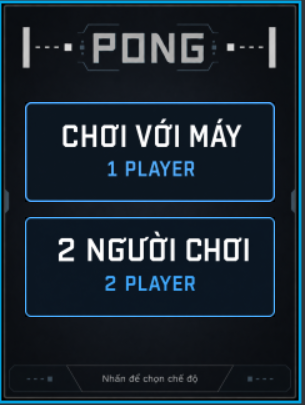
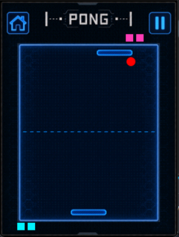
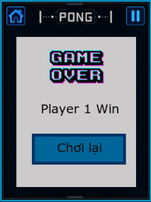

# Báo cáo đồ án: Game Ping Pong trên STM32F429I-DISCO và TouchGFX

Dự án xây dựng game Ping Pong dạng dọc chạy trực tiếp trên board STM32F429I-DISCO, sử dụng TouchGFX để hiển thị giao diện 240 x 320 px và FreeRTOS để tách luồng giao diện khỏi luồng đọc phần cứng. Người chơi điều khiển paddle bằng biến trở trượt, hệ thống hỗ trợ chế độ chơi với CPU và chế độ hai người chơi cục bộ.

> Ảnh minh họa trong báo cáo đang để ở dạng placeholder. Có thể bổ sung ảnh vào thư mục `docs/images/` hoặc thay đường dẫn ảnh theo nhu cầu.

## Mục lục

- [Giới thiệu](#giới-thiệu)
- [Tác giả](#tác-giả)
- [Môi trường hoạt động](#môi-trường-hoạt-động)
- [Sơ đồ schematic](#sơ-đồ-schematic)
- [Tích hợp hệ thống](#tích-hợp-hệ-thống)
- [Đặc tả hàm](#đặc-tả-hàm)
- [Kết quả](#kết-quả)
- [Hạn chế và hướng phát triển](#hạn-chế-và-hướng-phát-triển)

## Giới thiệu

__Đề bài/Mục tiêu sản phẩm__: Thiết kế và triển khai một trò chơi Ping Pong trên nền tảng STM32F429I-DISCO. Sản phẩm cần có giao diện đồ họa, tương tác thời gian thực, điều khiển bằng phần cứng ngoại vi và phản hồi rung khi người chơi đỡ bóng thành công.

__Hướng tiếp cận__: Dự án được triển khai theo hướng tách rõ logic game, giao diện và phần cứng.

- Phần giao diện sử dụng TouchGFX với hai màn hình chính: màn hình chọn chế độ và màn hình chơi, tích hợp hiển thị 3 ô mạng trực quan cho mỗi người chơi.
- Phần xử lý game nằm trong `GameEngine`, viết bằng C++ thuần, không phụ thuộc trực tiếp vào HAL, FreeRTOS hay widget TouchGFX.
- Phần đọc phần cứng sử dụng **Dual ADC Mode (ADC1 & ADC2) + DMA (Circular)** để lấy mẫu đồng thời 2 biến trở không tốn CPU. `HardwareTask` lấy dữ liệu trực tiếp từ mảng DMA ngầm và điều khiển haptic motor.
- Nút bấm **USER PA0** sử dụng **Ngắt ngoài EXTI0** hỗ trợ nhận diện nhấn đơn (Pause/Continue) và nhấn đúp (Back to Home).
- `Model` và `Presenter` của TouchGFX đóng vai trò cầu nối giữa backend C và giao diện C++.
- Luật chơi đấu 3 mạng (First-to-3): Mỗi bên khởi đầu với 3 mạng. Mỗi lần để lọt bóng sẽ mất 1 mạng, bóng được phát lại ở trung tâm sân. Bên nào hết 3 mạng trước sẽ thua.

__Sản phẩm__:

1. Màn hình chọn chế độ `VS_CPU` hoặc `TWO_PLAYERS`.
2. Màn hình game Ping Pong dọc với sân chơi, hai paddle, bóng, nút Home, Pause, Continue và chỉ báo 3 mạng ở 2 góc.
3. Chế độ chơi với CPU, trong đó người chơi điều khiển paddle dưới và CPU điều khiển paddle trên.
4. Chế độ hai người chơi, trong đó Player 1 điều khiển paddle dưới và Player 2 điều khiển paddle trên.
5. Điều khiển paddle bằng hai biến trở trượt/xoay đọc đồng thời qua Dual ADC Mode (ADC1 & ADC2) + DMA Circular 32-bit.
6. Phản hồi rung bằng hai motor: paddle nào đỡ bóng thì motor tương ứng rung trong khoảng 80 ms.
7. Hiển thị 3 ô mạng trực quan cho Player 1 (góc dưới trái) và Player 2/CPU (góc trên phải), giảm dần khi mất điểm.
8. Popup kết quả hiển thị người thắng sau 3 mạng và nút `Chơi lại`.
9. Nút USER PA0 trên board điều khiển qua ngắt ngoài EXTI0 (Nhấn 1 lần: Tạm dừng / Nhấn đúp: Về Home).

Ảnh minh họa dự kiến:







## Tác giả

- Tên nhóm: `anti`
- Thành viên trong nhóm:

| STT | Họ tên | MSSV | Công việc |
|---:|---|---|---|
| 1 | Đỗ Sơn Tùng | 20225425 | Xử lý tính toán góc bay, logic game, kiểm thử và viết báo cáo |
| 2 | Lưu Tuấn Hùng | 20225131 | Cài đặt chân chip, Đọc dữ liệu từ thanh trượt bằng DMA, Cài đặt hàm ngắt nút PA0 |
| 3 | Đỗ Tất Tuấn | 20225423 | Tạo codebase, design các screen, xử lí queue motor rung |
| 4 | Vũ Tiến Thăng | 20225396 | Đọc dữ liệu biến phần cứng, tích hợp TouchGFX (Model/Presenter), ghép input với GameEngine xử lý UI |
| 5 | Nguyễn Xuân Tùng | 20225426 | Đọc dữ liệu biến phần cứng, tích hợp TouchGFX (Model/Presenter), ghép input với GameEngine xử lý UI |

## Môi trường hoạt động

### Phần cứng

| Thành phần | Thông tin |
|---|---|
| Board chính | STM32F429I-DISCO |
| MCU | STM32F429ZIT6, Cortex-M4F, 180 MHz |
| Màn hình | LCD 240 x 320 px|


### Phần mềm và công cụ

| Thành phần | Phiên bản/Vai trò |
|---|---|
| STM32CubeIDE | Build, debug và flash firmware |
| STM32CubeMX | Cấu hình clock, GPIO, ADC, DMA, FreeRTOS, TouchGFX |
| TouchGFX Designer | Thiết kế giao diện, sinh code UI và asset |
| TouchGFX | 4.26.1 |
| FreeRTOS CMSIS V2 | Quản lý `HardwareTask` và `GUI_Task` |

### Bill of materials

| STT | Tên linh kiện | Ý nghĩa |
|---:|---|---|
| 1 | STM32F429I-DISCO | Board chạy firmware, màn hình, touch và USER button |
| 2 | Biến trở trượt 1 | Điều khiển paddle dưới của Player 1 |
| 3 | Biến trở trượt 2 | Điều khiển paddle trên của Player 2 hoặc phục vụ chế độ hai người |
| 4 | Module motor rung 1 | Phản hồi khi Player 1 đỡ bóng |
| 5 | Module motor rung 2 | Phản hồi khi Player 2 hoặc CPU đỡ bóng |

### Cấu trúc dự án

```text
.
├── Core/
│   ├── Inc/
│   │   ├── app_backend.h
│   │   └── main.h
│   └── Src/
│       └── main.c
├── TouchGFX/
│   ├── assets/
│   │   ├── fonts/
│   │   ├── images/
│   │   └── texts/
│   ├── generated/
│   ├── gui/
│   │   ├── include/gui/game/
│   │   ├── include/gui/model/
│   │   ├── include/gui/screen1_screen/
│   │   ├── include/gui/screen2_screen/
│   │   └── src/
│   ├── target/
│   └── Project-Nhung.touchgfx
├── Drivers/
├── Middlewares/
├── STM32CubeIDE/
├── gcc/
├── STM32F429I_DISCO_REV_D01.ioc
└── README.md
```

## Sơ đồ schematic

### Kết nối biến trở trượt

Mỗi biến trở có các chân `VCC`, `GND`, `OTA` và có thể có thêm nhánh `OTB`. Dự án chỉ dùng một đầu ra analog cho mỗi biến trở.

| Thiết bị | Chân module | Chân STM32F429I-DISCO | Ghi chú |
|---|---|---|---|
| Biến trở Player 1 | VCC | 3V3 | Không cấp 5 V vào biến trở để tránh vượt ngưỡng ADC |
| Biến trở Player 1 | GND | GND | GND chung |
| Biến trở Player 1 | OTA | PA5 / ADC1_IN5 / P1 pin 21 | Điều khiển paddle dưới |
| Biến trở Player 2 | VCC | 3V3 | Không cấp 5 V vào biến trở |
| Biến trở Player 2 | GND | GND | GND chung |
| Biến trở Player 2 | OTA | PC3 / ADC2_IN13 / P1 pin 15 | Điều khiển paddle trên trong `TWO_PLAYERS` (Master ADC1 + Slave ADC2) |

### Kết nối module motor rung

| Thiết bị | Chân module | Chân STM32F429I-DISCO | Ghi chú |
|---|---|---|---|
| Motor Player 1 | VCC | 5V | Nguồn đủ dòng cho motor |
| Motor Player 1 | GND | GND chung | Phải nối chung với GND STM32 |
| Motor Player 1 | IN | PC8 / P2 pin 55 | GPIO active-high |
| Motor Player 2/CPU | VCC | 5V | Nguồn đủ dòng cho motor |
| Motor Player 2/CPU | GND | GND chung | Phải nối chung với GND STM32 |
| Motor Player 2/CPU | IN | PC11 / P2 pin 44 | GPIO active-high |

Module motor đã có tầng driver, không nối motor trần trực tiếp vào GPIO. Khi khởi động, firmware đặt PC8 và PC11 ở trạng thái LOW để motor không rung ngoài ý muốn.

### Nút và ngoại vi có sẵn trên board

| Chân | Chức năng |
|---|---|
| PA0 | USER button, active-high, Ngắt ngoài EXTI0 (Nhấn 1 lần: Pause / Nhấn đúp: Back Home) |


## Tích hợp hệ thống

### Tổng quan luồng hệ thống

```text
Biến trở PA5/PC3
    -> ADC1 + ADC2 Dual Regular Simultaneous
    -> DMA circular ghi mẫu 32-bit vào dual_adc_buffer
    -> HardwareTask đọc buffer DMA và lọc tín hiệu
    -> latestInputMessage 32-bit chứa Player 1 + Player 2
    -> AppBackend_GetLatestInput()
    -> Model::tick()
    -> Screen2Presenter
    -> Screen2View::ball_timertick()
    -> GameEngine::update()
    -> Cập nhật widget TouchGFX
    -> Gửi haptic event nếu paddle đỡ bóng
    -> hapticQueue
    -> HardwareTask bật/tắt PC8 hoặc PC11 trong 80 ms
```

### Thành phần phần cứng và vai trò

| Thành phần | Vai trò trong hệ thống |
|---|---|
| STM32F429ZIT6 | Chạy toàn bộ firmware, game loop, UI và tác vụ phần cứng |
| LCD 240 x 320 | Hiển thị menu, sân chơi, paddle, bóng, popup kết quả |
| Touchscreen | Tương tác với nút trên UI: chọn mode, Home, Pause, Continue, Chơi lại |
| Biến trở PA5 | Input analog cho Player 1 |
| Biến trở PC3 | Input analog cho Player 2 |
| Motor PC8 | Rung khi Player 1 đỡ bóng |
| Motor PC11 | Rung khi Player 2 hoặc CPU đỡ bóng |
| USER PA0 | Nút vật lý để Pause hoặc Home tùy cấu hình |

### Thành phần phần mềm và vai trò

| Thành phần | File chính | Vai trò |
|---|---|---|
| Khởi tạo HAL/peripheral | `Core/Src/main.c` | Cấu hình clock, GPIO, DMA, ADC1, FMC, LTDC, DMA2D, TouchGFX và FreeRTOS |
| Backend phần cứng | `Core/Src/main.c`, `Core/Inc/app_backend.h` | Publish input ADC, consume PA0, gửi lệnh haptic |
| HardwareTask | `Core/Src/main.c` | Đọc `dual_adc_buffer` mỗi 10 ms, lọc tín hiệu, publish input, xử lý queue motor |
| PA0 interrupt | `Core/Src/stm32f4xx_it.c`, `Core/Src/main.c` | `EXTI0_IRQHandler()` chuyển ngắt PA0 vào `HAL_GPIO_EXTI_Callback()` để phát hiện nhấn đơn/nhấn đúp |
| Model | `TouchGFX/gui/src/model/Model.cpp` | Lưu `GameMode`, giữ input mới nhất, gọi backend haptic |
| Screen 1 | `Screen1View`, `Screen1Presenter` | Chọn `VS_CPU` hoặc `TWO_PLAYERS` |
| Screen 2 | `Screen2View`, `Screen2Presenter` | Chạy tick game, đồng bộ widget, pause/home/play again, popup kết quả |
| Game engine | `TouchGFX/gui/include/gui/game/GameEngine.hpp` | Quản lý physics, collision, CPU, state và winner |

### Cấu hình TouchGFX

| Màn hình | Thành phần | Vị trí/Kích thước | Vai trò |
|---|---|---|---|
| Screen 1 | `Bg1` | 0,0 - 240 x 320 | Nền menu |
| Screen 1 | `oneButton` | 20,80 - 200 x 80 | Chọn chơi với CPU |
| Screen 1 | `twoButton` | 20,172 - 200 x 80 | Chọn hai người chơi |
| Screen 2 | `Bg2` | 0,0 - 240 x 320 | Nền game |
| Screen 2 | `San` | 24,58 - 192 x 241 | Sân chơi |
| Screen 2 | `p1` | Y = 280, 48 x 11 | Paddle dưới |
| Screen 2 | `p2` | Y = 65, 48 x 11 | Paddle trên |
| Screen 2 | `circle1` | 12 x 12 | Bóng |
| Screen 2 | `home` | 9,9 - 30 x 30 | Quay về Screen 1 |
| Screen 2 | `pause` | 201,9 - 30 x 30 | Tạm dừng |
| Screen 2 | `continueButton` | 201,9 - 30 x 30 | Tiếp tục |
| Screen 2 | `box1`, `over`, `textResult1`, `flexButton1` | Popup | Hiển thị kết quả và chơi lại |

### Luồng điều hướng

```text
Khởi động
    -> HAL_Init()
    -> SystemClock_Config()
    -> MX_GPIO_Init(), MX_DMA_Init(), MX_ADC1_Init(), MX_ADC2_Init(), MX_TouchGFX_Init()
    -> HAL_ADC_Start(&hadc2)
    -> HAL_ADCEx_MultiModeStart_DMA(&hadc1, &dual_adc_buffer, 1)
    -> Tạo hapticQueue
    -> Tạo HardwareTask và GUI_Task
    -> TouchGFX hiển thị Screen 1
    -> Người dùng chọn mode
    -> Screen 2 reset GameEngine theo mode
    -> READY trong 30 tick
    -> PLAYING
    -> PAUSED hoặc GAME_OVER tùy thao tác và kết quả
```

### Trạng thái game

| State | Ý nghĩa |
|---|---|
| `READY` | Reset vị trí, chờ 30 tick trước khi bóng bắt đầu chạy |
| `PLAYING` | Đọc input, cập nhật paddle, bóng, collision và haptic |
| `PAUSED` | Giữ nguyên bóng/paddle, tắt haptic |
| `GAME_OVER` | Dừng physics, tắt haptic, hiện popup kết quả |

### Luật gameplay

- Paddle dưới là Player 1.
- Paddle trên là CPU trong `VS_CPU`.
- Paddle trên là Player 2 trong `TWO_PLAYERS`.
- Giá trị ADC sau chuẩn hóa nằm trong khoảng 0..1000.
- Input tăng thì paddle đi sang phải.
- Bóng chạm biên trái/phải sẽ bật lại.
- Bóng chạm paddle sẽ đổi hướng Y và thay đổi vận tốc X theo độ lệch tâm va chạm.
- Mỗi bên khởi đầu trận đấu với **3 mạng** (màn hình hiển thị 3 ô vuông Cyan ở góc dưới trái cho Player 1 và 3 ô vuông Magenta ở góc trên phải cho Player 2/CPU).
- Bóng vượt hoàn toàn qua cạnh trên: Player 2/CPU bị trừ 1 mạng. Bóng được respawn ở tâm sân để tiếp tục thi đấu.
- Bóng vượt hoàn toàn qua cạnh dưới: Player 1 bị trừ 1 mạng. Bóng được respawn ở tâm sân để tiếp tục thi đấu.
- Khi một bên mất hết 3 mạng (0 mạng còn lại): Trận đấu dừng lại và hiển thị popup GAME OVER thông báo người chiến thắng.

## Đặc tả hàm

### Nhóm hàm backend phần cứng

#### `AppBackend_GetLatestInput`

```c
uint8_t AppBackend_GetLatestInput(uint16_t* player1, uint16_t* player2);
```

Hàm lấy snapshot input mới nhất của hai người chơi từ biến `latestInputMessage`. Hai giá trị input được đóng gói trong một word 32-bit để đảm bảo Player 1 và Player 2 cùng thuộc một mẫu đọc.

| Tham số | Ý nghĩa |
|---|---|
| `player1` | Con trỏ nhận giá trị input Player 1, chuẩn hóa 0..1000 |
| `player2` | Con trỏ nhận giá trị input Player 2, chuẩn hóa 0..1000 |

| Giá trị trả về | Ý nghĩa |
|---|---|
| `1` | Lấy dữ liệu thành công |
| `0` | Con trỏ truyền vào không hợp lệ |

#### `AppBackend_ConsumePa0Event`

```c
uint8_t AppBackend_ConsumePa0Event(void);
```

Hàm lấy và consume sự kiện USER PA0 mới nhất do ngắt EXTI0 publish. Mỗi sự kiện được đóng gói kèm sequence trong `latestPa0EventMessage`, vì vậy GUI chỉ xử lý một lần cho mỗi nhấn đơn hoặc nhấn đúp.

| Giá trị trả về | Ý nghĩa |
|---|---|
| `APP_PA0_EVENT_NONE` | Không có sự kiện mới |
| `APP_PA0_EVENT_SINGLE_PRESS` | Nhấn đơn, dùng để Pause/Continue |
| `APP_PA0_EVENT_DOUBLE_PRESS` | Nhấn đúp, dùng để Back Home |

#### `AppBackend_ResetPa0Gesture`

```c
void AppBackend_ResetPa0Gesture(void);
```

Hàm reset trạng thái consume PA0 khi vào hoặc rời màn hình chơi. Việc này tránh việc một sự kiện PA0 cũ còn tồn tại trong backend bị xử lý lại ở lần vào Screen 2 tiếp theo.

#### `AppBackend_SendHaptic`

```c
void AppBackend_SendHaptic(uint8_t command);
```

Hàm gửi lệnh haptic từ GUI sang `HardwareTask` qua `hapticQueue`. Nếu queue đầy, hàm bỏ một message cũ rồi đưa message mới vào để GUI không bị block.

| Lệnh | Ý nghĩa |
|---|---|
| `APP_HAPTIC_PLAYER_1` | Rung motor Player 1 qua PC8 |
| `APP_HAPTIC_PLAYER_2` | Rung motor Player 2/CPU qua PC11 |
| `APP_HAPTIC_STOP_ALL` | Reset queue và tắt cả hai motor |

#### `HAL_GPIO_EXTI_Callback`

```c
void HAL_GPIO_EXTI_Callback(uint16_t GPIO_Pin);
```

Callback được HAL gọi sau khi `EXTI0_IRQHandler()` xử lý ngắt PA0. Code hiện tại chống dội theo mốc 50 ms, đếm cạnh nhấn rising-edge và phân loại:

- Nhấn đơn: publish `APP_PA0_EVENT_SINGLE_PRESS`.
- Nhấn đúp: nếu có cạnh nhấn thứ hai trong khoảng 350 ms, publish `APP_PA0_EVENT_DOUBLE_PRESS`.

#### `StartHardwareTask`

```c
void StartHardwareTask(void *argument);
```

Task FreeRTOS xử lý toàn bộ phần cứng phụ trợ cho game:

- Tắt hai motor khi task bắt đầu.
- Đọc mẫu 32-bit mới nhất từ `dual_adc_buffer` theo chu kỳ 10 ms.
- Tách 16 bit thấp thành raw Player 1 từ ADC1/PA5 và 16 bit cao thành raw Player 2 từ ADC2/PC3.
- Lọc EMA bằng số nguyên.
- Chuẩn hóa raw ADC 0..4095 về input 0..1000.
- Publish input qua `latestInputMessage`.
- Log ADC qua USART1 115200 mỗi 500 ms.
- Nhận lệnh haptic từ `hapticQueue`.
- Bật motor tương ứng trong 80 ms rồi tự tắt.

### Nhóm hàm Model và Presenter

#### `Model::tick`

```cpp
void Model::tick();
```

Hàm được TouchGFX gọi theo tick framework. Trên target thật, hàm gọi `AppBackend_GetLatestInput()` để cập nhật `player1Input` và `player2Input`. Trên simulator, phần backend được bỏ qua bằng `#ifndef SIMULATOR`.

#### `Model::setGameMode` và `Model::getGameMode`

```cpp
void setGameMode(GameMode mode);
GameMode getGameMode() const;
```

Hai hàm lưu và đọc chế độ chơi hiện tại. `Screen1Presenter` set mode, `Screen2Presenter` đọc mode khi vào màn hình chơi.

#### `Model::vibratePlayer1`, `Model::vibratePlayer2`, `Model::stopAllHaptics`

```cpp
void vibratePlayer1();
void vibratePlayer2();
void stopAllHaptics();
```

Các hàm chuyển yêu cầu rung từ UI sang backend. `stopAllHaptics()` được gọi khi Pause, Home, Game Over hoặc rời Screen 2.

### Nhóm hàm Screen 1

#### `Screen1View::selectVsCpu`

```cpp
void Screen1View::selectVsCpu();
```

Hàm được gọi khi nhấn nút chơi với CPU. View gọi Presenter để set `GameMode::VS_CPU`, sau đó chuyển sang Screen 2.

#### `Screen1View::selectTwoPlayers`

```cpp
void Screen1View::selectTwoPlayers();
```

Hàm được gọi khi nhấn nút hai người chơi. View gọi Presenter để set `GameMode::TWO_PLAYERS`, sau đó chuyển sang Screen 2.

### Nhóm hàm Screen 2

#### `Screen2View::setupScreen`

```cpp
void Screen2View::setupScreen();
```

Hàm reset `GameEngine` theo mode hiện tại, xóa trạng thái game over, consume sự kiện PA0 cũ, gắn callback cho `continueButton`, ẩn popup và đồng bộ widget ban đầu.

#### `Screen2View::ball_timertick`

```cpp
void Screen2View::ball_timertick();
```

Đây là game loop chính, được `Screen2ViewBase::handleTickEvent()` gọi mỗi tick TouchGFX.

Luồng xử lý:

1. Consume PA0 event từ Presenter/Model. Nếu là `DOUBLE_PRESS` thì về Screen 1, nếu là `SINGLE_PRESS` thì toggle pause.
2. Gọi `gameEngine.update(player1Input, player2Input)`.
3. Nếu engine phát `EVENT_HIT_PLAYER_1`, gọi rung motor Player 1.
4. Nếu engine phát `EVENT_HIT_PLAYER_2`, gọi rung motor Player 2/CPU.
5. Đồng bộ vị trí `p1`, `p2`, `circle1` với engine.
6. Nếu có `EVENT_GAME_OVER`, gọi `onGameOver()`.

#### `Screen2View::togglePause`

```cpp
void Screen2View::togglePause();
```

Hàm chuyển `PLAYING` sang `PAUSED` hoặc ngược lại. Khi pause, hàm gọi `stopAllHaptics()` và đổi ảnh nút Pause thành Continue.

#### `Screen2View::goHomeSafely`

```cpp
void Screen2View::goHomeSafely();
```

Hàm tắt toàn bộ haptic rồi chuyển về Screen 1. Điều này tránh trường hợp motor vẫn rung khi rời màn hình game.

#### `Screen2View::playAgain`

```cpp
void Screen2View::playAgain();
```

Hàm tắt haptic, reset engine theo mode hiện tại, ẩn popup, reset nút pause và đồng bộ lại paddle/bóng. Mode được giữ nguyên để người chơi có thể bắt đầu trận mới nhanh.

#### `Screen2View::onGameOver`

```cpp
void Screen2View::onGameOver();
```

Hàm dừng haptic, xác định winner và hiển thị popup. Nếu mode là `VS_CPU` và winner không phải Player 1, popup hiển thị `CPU`. Nếu mode là `TWO_PLAYERS`, popup hiển thị `Player 2`.

### Nhóm hàm GameEngine

#### `GameEngine::reset`

```cpp
void reset(GameMode newMode);
```

Reset toàn bộ trạng thái trận đấu:

- Lưu mode mới.
- Đặt state về `READY`.
- Xóa winner.
- Đưa hai paddle về giữa.
- Đưa bóng về vị trí bắt đầu.
- Đặt vận tốc bóng ban đầu.
- Reset bộ đếm ready, CPU reaction và rally.

#### `GameEngine::update`

```cpp
uint8_t update(uint16_t player1Input, uint16_t player2Input);
```

Hàm cập nhật một bước game logic. Đây là lõi của trò chơi.

| Tham số | Ý nghĩa |
|---|---|
| `player1Input` | Input Player 1 đã chuẩn hóa 0..1000 |
| `player2Input` | Input Player 2 đã chuẩn hóa 0..1000 |

| Event trả về | Ý nghĩa |
|---|---|
| `EVENT_NONE` | Không có sự kiện đặc biệt |
| `EVENT_HIT_PLAYER_1` | Paddle dưới vừa đỡ bóng |
| `EVENT_HIT_PLAYER_2` | Paddle trên vừa đỡ bóng |
| `EVENT_GAME_OVER` | Trận đấu kết thúc |

Logic chính:

- Bỏ qua update nếu state là `PAUSED` hoặc `GAME_OVER`.
- Player 1 luôn điều khiển paddle dưới.
- Trong `TWO_PLAYERS`, Player 2 điều khiển paddle trên.
- Trong `VS_CPU`, paddle trên do CPU điều khiển.
- Khi `READY` đủ 30 tick, chuyển sang `PLAYING`.
- Cập nhật vị trí bóng bằng fixed-point Q8.8.
- Xử lý va chạm biên trái/phải.
- Xử lý va chạm circle-versus-rectangle với paddle.
- Xử lý sudden-death khi bóng vượt biên trên hoặc dưới.

#### `GameEngine::togglePause`

```cpp
void togglePause();
```

Hàm đổi trạng thái giữa `PLAYING` và `PAUSED`. Các state khác không bị thay đổi.

#### `mapInputToPaddle`

```cpp
static int16_t mapInputToPaddle(uint16_t input);
```

Hàm ánh xạ input 0..1000 sang tọa độ X của paddle trong khoảng `PADDLE_MIN_X..PADDLE_MAX_X`. Input lớn hơn 1000 sẽ bị clamp về 1000.

#### `circleTouchesPaddle`

```cpp
bool circleTouchesPaddle(int16_t paddleX, int16_t paddleY) const;
```

Hàm kiểm tra va chạm giữa bóng tròn và paddle chữ nhật. Engine lấy điểm gần nhất trên paddle so với tâm bóng, sau đó so sánh bình phương khoảng cách với bình phương bán kính bóng.

#### `updateCpu`

```cpp
void updateCpu();
```

Hàm điều khiển paddle trên trong chế độ `VS_CPU`. CPU cập nhật mục tiêu mỗi 4 tick, bám theo bóng khi bóng đi lên, trở về giữa sân khi bóng đi xuống và có thêm sai số nhỏ để CPU không bất bại.

#### `updateHorizontalVelocity`

```cpp
void updateHorizontalVelocity(int16_t paddleX);
```

Hàm thay đổi vận tốc ngang của bóng theo độ lệch giữa tâm bóng và tâm paddle. Va vào mép paddle sẽ tạo góc bật lớn hơn, giúp gameplay tự nhiên hơn.

## Kết quả

### Kết quả triển khai phần mềm

- Đã có giao diện TouchGFX hoàn chỉnh cho Screen 1 và Screen 2.
- Đã triển khai `GameMode::VS_CPU` và `GameMode::TWO_PLAYERS`.
- Đã triển khai `GameState::READY`, `PLAYING`, `PAUSED`, `GAME_OVER`.
- Đã tách `GameEngine` khỏi HAL/FreeRTOS/TouchGFX widget để dễ kiểm thử.
- Đã cấu hình thành công **Dual ADC Mode (ADC1 - PA5 và ADC2 - PC3) + DMA 32-bit (Circular)** để lấy mẫu đồng thời 2 kênh biến trở với 0% thời gian chờ CPU.
- Đã có lọc EMA và chuẩn hóa input về 0..1000.
- Đã triển khai **Ngắt ngoài EXTI0 (PA0)** chống dội phím, hỗ trợ nhấn 1 lần (Pause/Continue) và nhấn đúp (Back to Home).
- Đã triển khai luật chơi **Đấu 3 Mạng (First-to-3 / Best of 5)** cùng hệ thống bóng respawn tự động.
- Đã thiết kế hiển thị **3 ô mạng trực quan** trên giao diện TouchGFX (Cyan cho P1, Magenta cho P2/CPU) tự động cập nhật giảm dần theo trận đấu.
- Đã có haptic queue để rung motor PC8 hoặc PC11 trong 80 ms khi paddle đỡ bóng.
- Đã có popup game-over và nút `Chơi lại`.


### Ảnh kết quả

| Ảnh | Nội dung cần chụp | Đường dẫn gợi ý |
|---|---|---|
| 1 | Board STM32F429I-DISCO và dây nối biến trở/motor | `docs/images/hardware-setup.png` |
| 2 | Màn hình chọn chế độ | `docs/images/screen1-menu.png` |
| 4 | Màn hinh người chơi (hiển thị 3 mạng) | `docs/images/screen2-gameplay.png` |
| 5 | Popup kết quả Player 1 thắng | `docs/images/game-over-popup.png` |

## Hạn chế và hướng phát triển

- CPU hiện tại chỉ có một mức độ khó cố định, có thể bổ sung tùy chọn nhiều cấp độ phản xạ (Dễ / Trung bình / Khó).
- Chưa có hiệu ứng âm thanh (Audio/Buzzer tone).
- Chưa có lưu lịch sử trận đấu hay bảng xếp hạng high score.
- Có thể bổ sung màn hình hướng dẫn đấu dây và hiệu chỉnh biến trở.
- Có thể thêm bước calibration để lưu min/max ADC thực tế cho từng loại biến trở.
- Có thể bổ sung test tích hợp tự động cho build TouchGFX simulator.

## Tài liệu tham khảo trong dự án

- `readme-example.md`: skeleton báo cáo môn đồ án.
